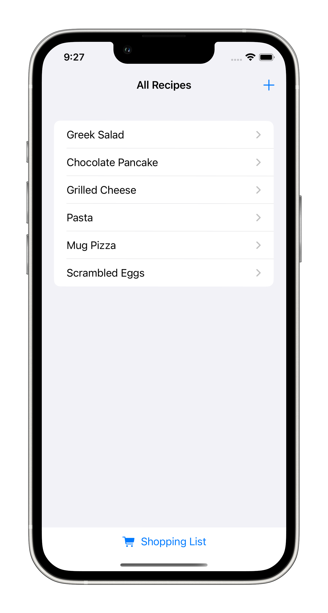

# Recipe Manager

A SwiftUI-based iOS app for managing and organizing your favorite recipes supporting live calorie data.

## Demo

  
  
  
  
  

---

## Features

- **Recipe Storage**: Save recipes with ingredients, directions, and serving information
- **Recipe Browsing**: View all your recipes in an organized list
- **Detailed View**: See complete recipe information including ingredients and step-by-step directions
- **Live Calorie Data**: Automatic calorie calculation using the Edamam Nutrition API
- **Shopping List**: Create shopping lists from your recipes
- **Stores Nearby**: Use Core Location to show nearby grocery stores to shop
- **Core Data Integration**: Persistent local storage for all your recipes

## Calorie Calculation

Recipe calories are automatically calculated using the [Edamam Nutrition Analysis API](https://developer.edamam.com/edamam-nutrition-api). The calculation process works as follows:

1. **Ingredient Processing**: When viewing a recipe, the app extracts individual ingredients from the recipe's ingredient list by splitting on newlines and trimming whitespace
2. **API Request**: The processed ingredients are sent as a JSON payload to the Edamam API nutrition-details endpoint
3. **Nutritional Analysis**: The API analyzes each ingredient quantity and type, returning comprehensive nutritional data including total calories for the entire recipe
4. **Real-time Display**: The calculated calories appear automatically in the recipe detail view when the API response is received

The calorie calculation is triggered automatically when a user opens a recipe's detailed view (`RecipeDetailedView.swift:130`). The API leverages the USDA food database to provide accurate nutritional analysis.

**Note**: An active internet connection is required for calorie calculation as it relies on the external Edamam API service.

## Requirements

- iOS 14.0+
- Xcode 12.0+
- Swift 5.0+

## Installation

1. Clone this repository
2. Open `recipe-manager.xcodeproj` in Xcode
3. Build and run the project on your iOS device or simulator

## Project Structure

- `recipe_managerApp.swift` - Main app entry point
- `ContentView.swift` - Welcome screen and navigation
- `RecipeListView.swift` - Main recipe list interface
- `AddRecipe.swift` - Form for adding new recipes
- `RecipeDetailedView.swift` - Detailed recipe view
- `ShoppingList.swift` - Shopping list functionality
- `MapView.swift` - Map integration features
- `Persistence.swift` - Core Data stack and sample data
- `recipe_manager.xcdatamodeld/` - Core Data model

## Core Data Model

The app uses Core Data for persistent storage with a `Recipe` entity containing:
- Name
- Ingredients
- Directions
- Servings
- Timestamp
- Unique ID

## Sample Data

The app includes sample recipes for testing:
- Greek Salad
- Chocolate Pancake
- Grilled Cheese
- Pasta
- Mug Pizza
- Scrambled Eggs
